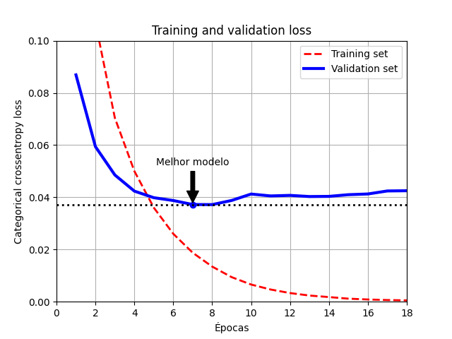

# Calcule o número ótimo de épocas para minimizar o overfitting

Data de entrega: 16/03/2024

## Enunciado

Usando o modelo dado em sala de aula, tente computar o número de épocas que minimize o overfitting da rede.

## Análises gráficas

             |  
:-------------------------:|:-------------------------:
  |  

## Conclusão

Como é possível observar no gráfico acima, o modelo apresentou um overfitting no conjunto de dados de treino, ou seja, a partir da 4ª época, a acurácia no conjunto de treino continuou a aumentar, enquanto a acurácia no conjunto de validação não acompanhou o aumento. Isso é um sinal de que o modelo está memorizando os dados de treino e não generalizando bem para novos dados.

Um ponto a ser observado é que por mais que o modelo começou a apresentar overfitting a partir da 4ª época, a acurácia no conjunto de validação continuou a aumentar até a 8ª época, o que é um sinal de que o modelo ainda não está completamente saturado e que ainda continua a aprender atributos relevantes quando ele começa a apresentar o overfitting, por mais que o *signal to noise ratio* esteja diminuindo.

Por fim, quando avaliamos o modelo no conjunto de teste, a acurácia foi de 97.2% (contra 98.6% no conjunto de validação), o que parece indicar de que o modelo generalizou bem para novos dados, porém que também apresentou overfitting para os dados de validação.

#### Resumo

- O modelo apresentou overfitting no conjunto de dados de treino a partir da 4ª época
- A acurácia no conjunto de validação continuou a aumentar até a 8ª época, o que indica que o modelo ainda que em overfitting, ainda está aprendendo atributos relevantes até a 8ª época.
- A acurácia no conjunto de teste foi relativamente menor que a acurácia no conjunto de validação, o que indica que o modelo generalizou bem para novos dados, porém que também apresentou overfitting para os dados de validação.

#### Métricas
| Conjunto de dados | Acurácia |
|--------------------|----------|
| Treino             | 99.6%    |
| Validação          | 98.8%    |
| Teste              | 97.2%    |