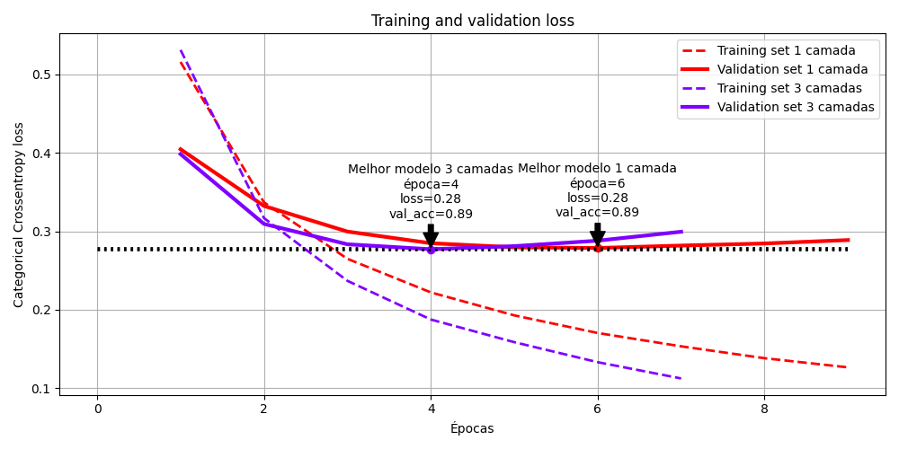
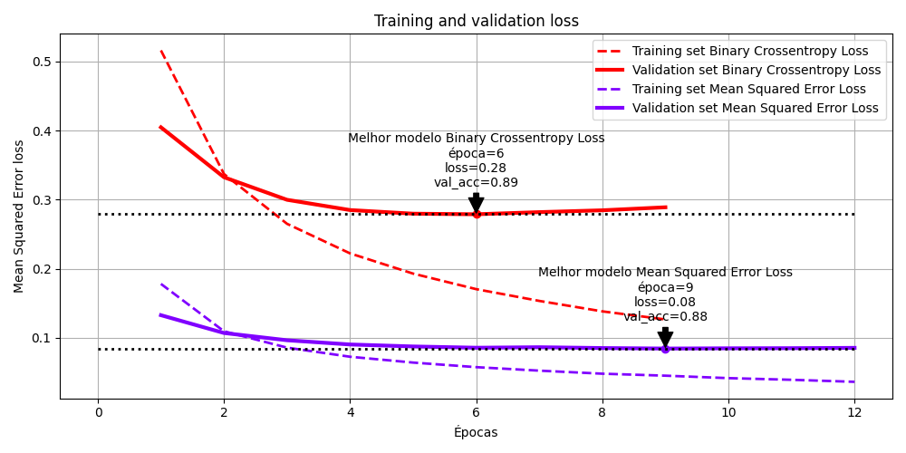
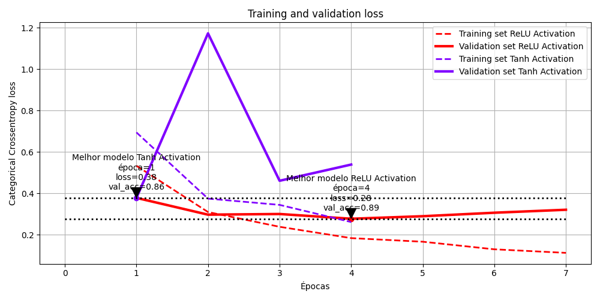

# IMDB: Ajustando arquitetura e hiperparâmetros

Data de entrega: 24/03/2024

## **Exercícios**

#### 1. Você utilizou duas camadas `Dense`. Use uma ou três camadas e veja como isso afeta a precisão na validação e no teste.



| Camadas | Acurácia de validação | Acurácia de teste |
|---------|-----------------------|-------------------|
| 1       | 89%                 | 89%             |
| 3       | 88%                 | 88%             |


**Análise**

Adicionar mais camadas não necessariamente melhora o desempenho do modelo. A adição de mais camadas pode aumentar a complexidade do modelo, o que pode levar ao *overfitting*.

Para o exercício de comparar o desempenho do modelo com uma ou três camadas `Dense`, é possível observar que o modelo com uma camada `Dense` obteve uma precisão de muito parecida com o modelo com uma camada `Dense`.

#### 2. Use camadas com mais unidades ocultas ou menos unidades ocultas: 32 unidades, 64 unidades, e assim por diante.

Arquiteturas testadas:
```python
# Testando modelo com 3 camadas da questão anterior, porém com 32 neurônios na camada oculta
architecture_sample1 = {
    'layers': [
        {'units': 16, 'activation': 'relu', 'input_shape': (10000,)},
        {'units': 32, 'activation': 'relu'},
        {'units': 1, 'activation': 'sigmoid'}
    ],
    'loss': 'binary_crossentropy',
    'optimizer': 'rmsprop',
    'metrics': ['accuracy']
}
# Testando modelo com 3 camadas da questão anterior, porém com 64 neurônios na camada oculta
architecture_sample2 = {
    'layers': [
        {'units': 16, 'activation': 'relu', 'input_shape': (10000,)},
        {'units': 64, 'activation': 'relu'},
        {'units': 1, 'activation': 'sigmoid'}
    ],
    'loss': 'binary_crossentropy',
    'optimizer': 'rmsprop',
    'metrics': ['accuracy']
}
# Testando arquitetura com 4 camadas e número de neurônios decrescente
architecture_sample3 = {
    'layers': [
        {'units': 64, 'activation': 'relu', 'input_shape': (10000,)},
        {'units': 32, 'activation': 'relu'},
        {'units': 16, 'activation': 'relu'},
        {'units': 1, 'activation': 'sigmoid'}
    ],
    'loss': 'binary_crossentropy',
    'optimizer': 'rmsprop',
    'metrics': ['accuracy']
}
```

| Modelo | Acurácia de validação | Acurácia de teste |
|--------|-----------------------|-------------------|
| 16-32     | 85.9%                 | 87.7%             |
| 16-64     | 86.1%                 | 87.4%             |
| 64-32-16 | 85.3%                 | 87.4%             |


**Análise**

Ao aumentar o número de unidades ocultas, não foi possível observar uma melhora significativa no desempenho do modelo

#### 3. Use a função de perda `mse` em vez de `binary_crossentropy`.



| Função de perda | Acurácia de validação | Acurácia de teste |
|------------------|-----------------------|-------------------|
| mse              | 88%                 | 88%             |
| binary_crossentropy | 89%                 | 88%             |

**Análise**

Como podemos observar no gráfico de perda x épocas, a função de perda `mse` apresenta um slope mais suave em comparação com a função de perda `binary_crossentropy`. Isso é ruim, pois um maior slope indica que a rede está aprendendo mais rápido. Um outro ponto é que a função de perda `mse` espera que a saída da rede seja um valor contínuo e entre (-inf, inf), enquanto a `binary_crossentropy` espera que a saída seja um valor entre (0, 1). Por isso, a função de perda `binary_crossentropy` é mais adequada para problemas de classificação binária.

Ainda é valido notar que as diferenças entre escalas entre as funções não significam que uma é melhor que a outra.

Por fim, a função `binary_crossentropy` foi capaz de convergir significativamente mais rápido que a função `mse`, porém não foi possível observar uma melhora significativa no desempenho do modelo no conjunto de dados de teste.

#### 4. Use a ativação `tanh` (uma ativação que era popular nos primeiros dias das redes neurais) em vez de `relu`.



| Função de ativação | Acurácia de validação | Acurácia de teste |
|--------------------|-----------------------|-------------------|
| tanh               | 86%                 | 87%             |
| relu               | 89%                 | 87%             |

**Análise**

Como é possível observar no gráfico de perda x épocas, a função de ativação `tanh` gera uma perda não convexa, o que é ruim, pois a rede não consegue aprender de forma eficiente. A função de ativação `relu` se mostrou mais estável e eficiente para o problema de classificação binária. Porém, mais uma vez, não foi possível observar uma melhora significativa no desempenho do modelo no conjunto de dados de teste.