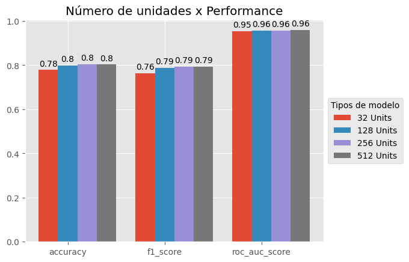
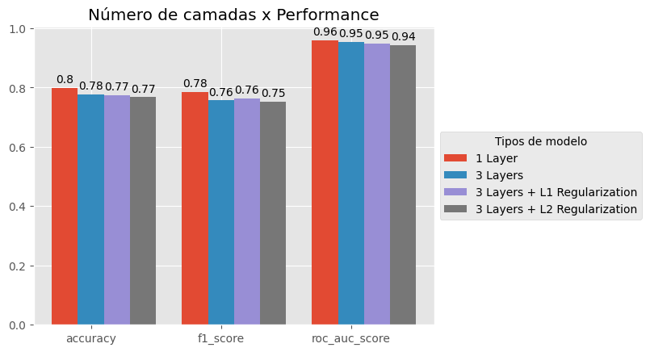

# Reuters: Ajustando N unidades e N camadas

Data de entrega: 07/04/2024

## **Exercícios**

### 1. Use camadas maiores ou menores: 32 unidades, 128 unidades, e assim por diante.

| Arquitetura | accuracy | f1_score | roc_auc_score |
|-------------|----------|----------|---------------|
| 32 Units    | 77.8%    | 76.3%    | 95.5%         |
| 128 Units   | 79.9%    | 78.7%    | 95.7%         |
| 256 Units   | 80.4%    | 79.3%    | 95.8%         |
| 512 Units   | 80.1%    | 79.1%    | 95.9%         |

**Análise**

A arquitetura com 128 unidades obteve uma acurácia de 79,9% no conjunto de teste, um pouco melhor que a arquitetura com 32 unidades. A arquitetura com 32 unidades obteve uma acurácia de 77,8% no conjunto de testes, um pouco pior que a arquitetura com 128 unidades. A arquitetura com 128 unidades foi a que obteve o melhor resultado, o que indica que arquiteturas menores não tem complexidade suficiente para aprender todos os padrões presentes nos dados para separar as 46 classes.

### 2. Usamos duas camadas ocultas `Dense`. Agora, use uma única camada oculta ou três camadas ocultas.

| Arquitetura                     | accuracy | f1_score | roc_auc_score |
|---------------------------------|----------|----------|---------------|
| 1 Camada                        | 79.7%    | 78.5%    | 95.8%         |
| 3 Camadas                       | 77.6%    | 75.6%    | 95.4%         |
| 3 Camadas + Regularização L1    | 77.2%    | 76.3%    | 94.8%         |
| 3 Camadas + Regularização L2    | 76.7%    | 75.3%    | 94.2%         |

**Análise**

O modelo com uma única camada oculta teve acurácia de 79,7%, enquanto o modelo de 3 camadas ocultas teve acurácia de 77,6%. Isso provavelmente ocorreu porque o modelo com uma única camada oculta tem complexidade suficiente para aprender os padrões presentes nos dados e separar as 46 classes, enquanto o modelo com 3 camadas ocultas pode ser mais complexo do que o necessário, teve mais overfitting - o que é uma tendência para o aumento do número de camadas.

Uma solução para o overfitting seria adicionar regularização às camadas ocultas. Fizemos isso e o modelo com 3 camadas ocultas + regularização (L1 e L2) tivesse uma acurácia um pior que o modelo com 3 camadas ocultas sem regularização. Isso demonstra que regulaziação nem sempre é a solução para overfitting e que é necessário testar diferentes arquiteturas para encontrar a melhor solução.

Um ponto importante também é que baseando-se na métrica `roc_auc_score`, o modelo com 1 camada oculta obteve o melhor resultado, o que indica que ele pode ser o mais adequado para esse problema.