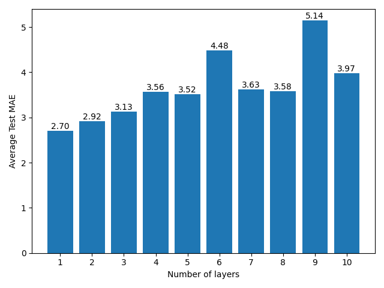
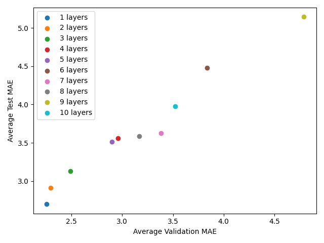

# Redes Neurais para Regressão - Boston Housing

Data de entrega: 14/04/2024

### Aprendizados
- Redes neurais para regressão
- Normalização dos dados
- Validação cruzada

## Análise

Média Test MAE para cada modelo              |  Validação vs Test MAE para cada modelo
:-------------------------:|:-------------------------:
  |  

Com base nos resultados obtidos, é possível observar que a medida que aumentamos o número de camadas da rede, o **overfitting** da rede aumenta (observe a tendência de crescimento do erro no gráfico de barras). Isso ocorre porque a rede passa a ter mais parâmetros para ajustar, o que pode levar a um ajuste excessivo dos dados de treinamento.