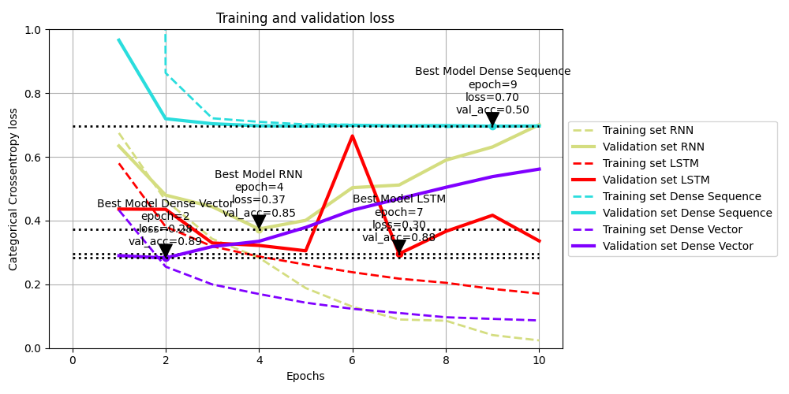

# IMDB: Redes recorrentes

Data de entrega: 25/05/2024

## **Exercícios**

#### 1. Faça uma discussão dos resultados. Compare-os com os outros modelos que usamos anteriormente para a mesma base de dados. Deveríamos esperar resultados melhores?

### Resolução

    

O melhor modelo foi o LSTM, com 88% de acurácia no conjunto de dados de teste. O modelo Dense Vectorized apresentou uma acurácia surpreendente de 87%, enquanto o modelo RNN com Embedding apresentou uma acurácia de 81%. Portanto, o modelo LSTM superou os outros modelos, mas o modelo Dense Vectorized também apresentou um bom desempenho e teve um tempo de treinamento significativamente menor. O modelo Dense Sequence foi o que apresentou o pior desempenho, com uma acurácia de 50%, o que faz sentido, pois a camada Dense não é a mais adequada para lidar com dados sequenciais. Os modelos LSTM e Dense Vectorized parecem ainda terem potencial para melhorar, pois sua curva de perda ainda não atingiu a estabilidade.

### Estatísticas dos modelos
| Modelo | Acurácia(teste) | Tempo de treinamento |
|--------|-----------------|----------------------|
| LSTM | 88.2% | 3min 26s |
| Dense Vectorized | 87.0% | 6s |
| RNN com Embedding | 81.3% | 1min 39s |
| Dense Sequence | 50.1% | 3s |