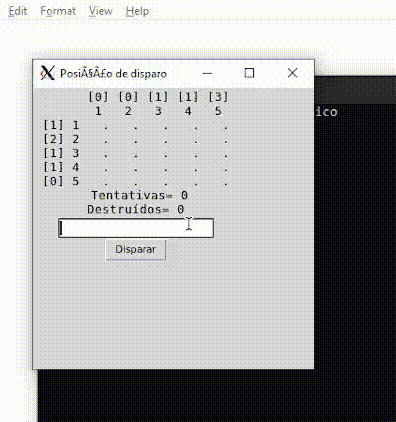

# Demonstração jogo Batalha Naval

     

No decorrer das aulas da disciplina de Engenharia de Software nós, alunos, arquitetamos o algorítmo de um jogo de Batalha Naval. O arquivo `BN_Monolitico`  é um binário executável (Linux) que contém a implementação dos códigos desenvolvidos durante as aulas em uma Interface gráfica intuitiva.