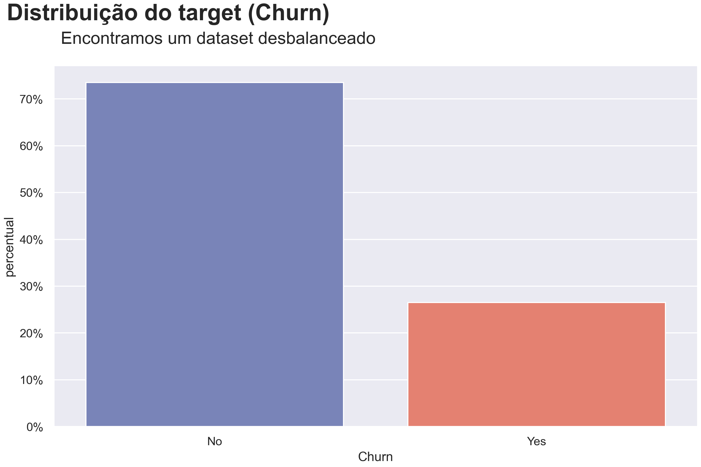
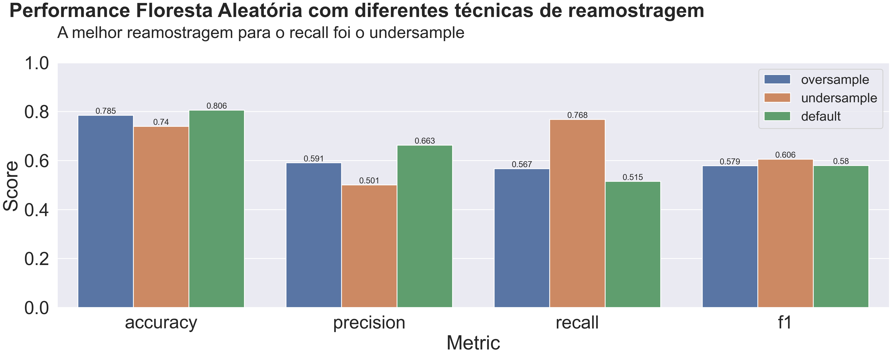
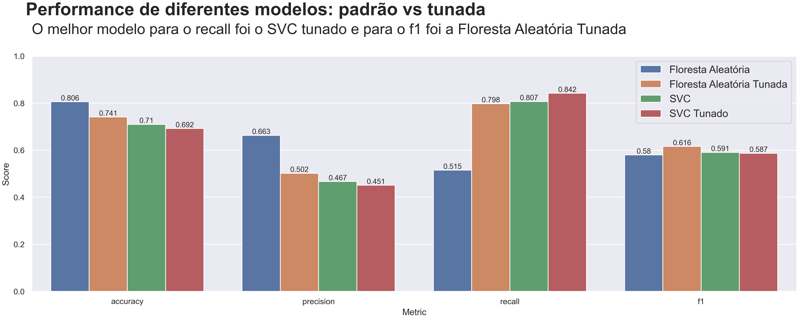
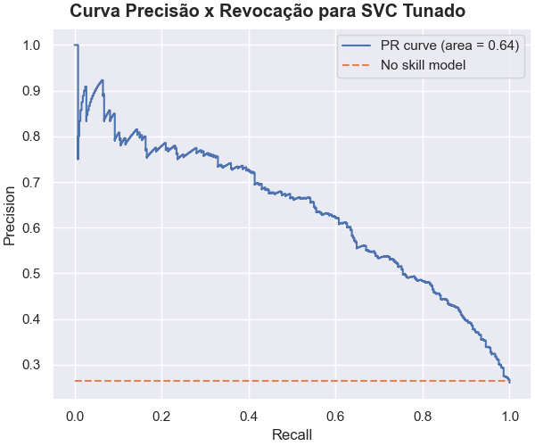
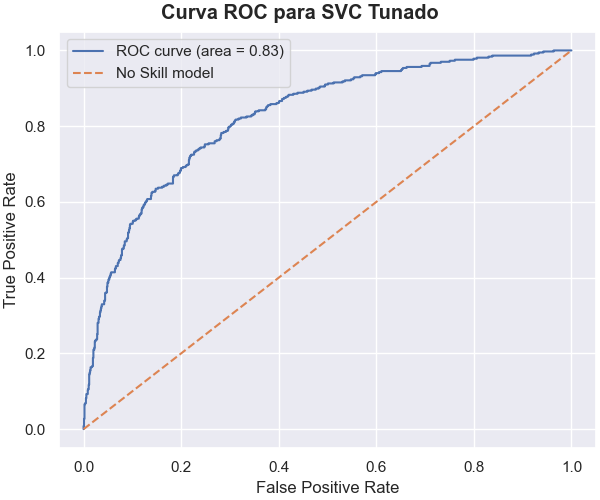
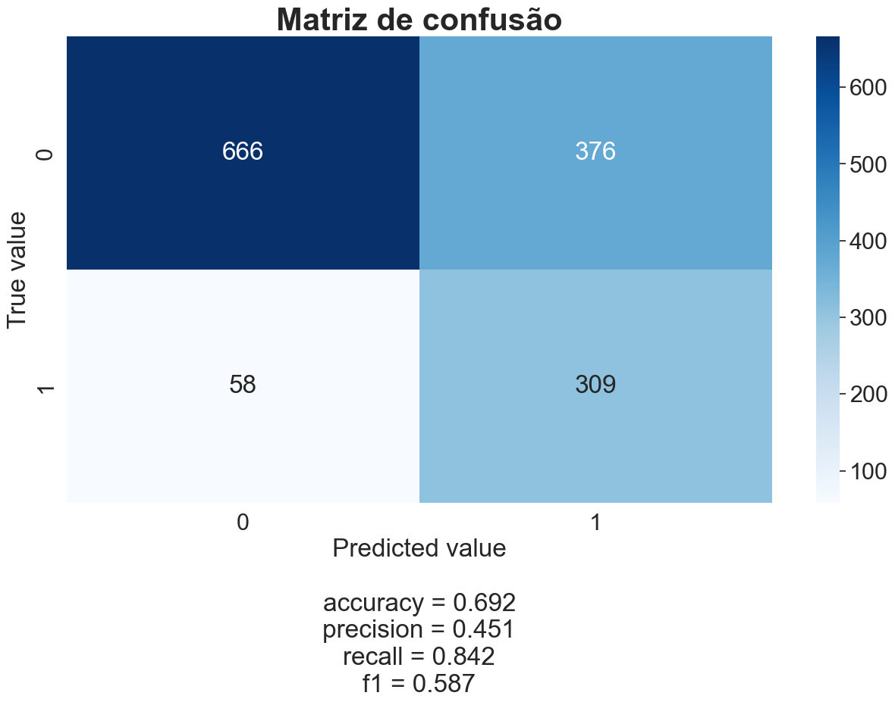

# Prevendo o “Churn” de clientes em uma empresa de telecomunicações
Análise e predição do `Churn` de clientes de uma empresa de Telecomunicações.

> Esse projeto foi desenvolvido para a disciplina de Mineração de Dados e entregue dia 27/09/2022 durante a minha graduação em Ciência de Dados e Inteligência Artificial na PUC-SP

<!-- SUMÁRIO -->

    
Sumário

    <ol>
        <li>
            <a href="#1-contextualização">Contextualização</a>
        </li>
        <li>
            <a href="#2-descrição-dos-dados">Descrição dos Dados</a>
            <ul>
                <li><a href="#o-que-o-dataset-nos-informa">O que o dataset nos informa</a></li>
            </ul>
        </li>
        <li>
            <a href="#3-objetivos-do-projeto">Objetivos do Projeto</a>
        </li>
        <li>
            <a href="#4-modelagem-e-avaliação-de-modelos">Modelagem e Avaliação de Modelos</a>
            <ul>
                <li><a href="#algorítmos-usados">Algorítmos usados</a></li>
                <li><a href="#métrica">Métrica</a></li>
                <li><a href="#técnica-de-reamostragem">Técnica de reamostragem</a></li>
            </ul>
        </li>
        <li>
            <a href="#5-resultados">Resultados</a>
        </li>
    </ol>
    </ol>

## 1. Contextualização

Muitos clientes migram entre operadoras de telecomunicações devido a fatores diversos, sendo 
essa prática é conhecida como “Churn”. Com uma análise do banco de dados dos clientes é 
possível  desenvolver  um  modelo  de  aprendizagem  de  máquina  que  seja  capaz  de  prever  os 
clientes  que  são  mais  propensos  a  migrar  de  operadora  e  assim  oferece-los  promoções 
diferenciadas visando retê-los. 

Uma empresa de telecomunicações está preocupada com o número de clientes que trocam seus 
negócios de telefonia fixa por concorrentes a cabo. Eles precisam entender quem está saindo. 
Imagine que você é um analista dessa empresa e precisa descobrir quem está saindo e por quê.

## 2. Descrição dos Dados

O dataset [pode ser encontrado no Kaggle](https://www.kaggle.com/datasets/blastchar/telco-customer-churn)

Número de instâncias (linhas): 7043

Número de atributos (preditores): 20

Variável alvo: `Churn`

### O que o dataset nos informa:

- Clientes que saíram no último mês - a coluna é chamada **Churn**, esse é o valor a ser 
previsto no modelo 
- Serviços para os quais cada cliente se inscreveu:  telefone, várias linhas, internet, 
segurança online, backup online, proteção de dispositivo, suporte técnico, streaming 
de TV e filmes. 
- Informações da conta do cliente: Informações da conta do cliente: há quanto tempo 
eles são clientes (tenure), contrato, forma de pagamento, faturamento sem papel, 
cobranças mensais e cobranças totais.  
- Informações demográficas sobre clientes: sexo, faixa etária e se têm parceiros e 
dependentes

## 3. Objetivos do Projeto

- Estudar cada feature para a melhor compreensão dos resultados 
- Faça uma análise exploratória dos dados 
- Caso exista, substituir cada item faltantes por um valor apropriado 
- Fazer o particionamento dos dados em treinamento (80%) e teste (20%) 
- Substituir os dados categóricos em texto para numéricos 
- Treinar e validar uma árvore de decisão e avaliar a precisão do modelo 
- Mostrar a matriz de confusão para o modelo

## 4. Modelagem e Avaliação de Modelos

### Algorítmos usados:
  * Árvore de Decisão
  * Floresta Aleatória
  * XGBoost
  * Regressão Logística
  * SVC

### Métrica:

Como para esse problema desejamos maximizar os verdadeiros positivos, escolhemos maximizar o `recall` dos modelos (ou seja, queremos englobar o máximo número de clientes que podem se tornar um churn - verdadeiros positivos - e nos importamos pouco com clientes que o modelo prevê como churn, mas não é - falsos positivos)

<h3>Técnica de reamostragem:</h3>

Testamos diferentes técnicas de reamostragem com o modelo Floresta Aleatória e a melhor técnica para o <i>recall</i> foi o <code>undersample</code>

 
 

## 5. Resultados:

- O melhor modelo foi o `SVC` (Support Vector Classifier) com a tunagem de hiperparâmetros.
- A métrica ROC-AUC e especialmente a métrica PR-AUC (já que a classe positiva é rara), mostram que o modelo foi capaz de aprender com os dados e cumprir o objetivo de negócio.
- Obtivemos uma quantidade considerável de falsos positivos, como esperávamos pois [escolhemos maximizar o recall](#métrica)

 
 

