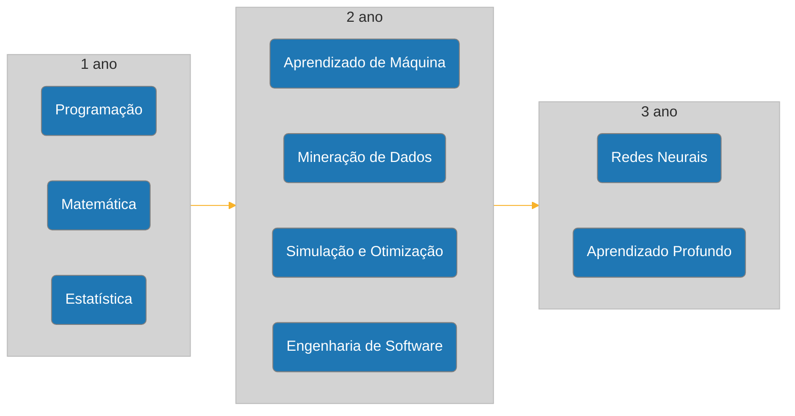

# CDIA PUC
Atividades acadêmicas e anotações da minha graduação em Ciência de Dados e Inteligência Artificial na PUC-SP
## Trilha de estudos

## Grade Curricular

| Sem. | Disciplina | CH |
| :-: | :-- | :-: |
| 1 | Consultoria Especializada De Apoio Ao Projeto Integrado - Matemática | 108 |
| 1 | Consultoria Especializada De Apoio Ao Projeto Integrado: Algorítmos E Programação | 108 |
| 1 | Estudos Orientados: Ciência De Dados E Inteligência Artificial | 72 |
| 1 | Introdução Ao Pensamento Teológico | 54 |
| 1 | Projeto Integrado - Aquisição E Visualização De Dados (Storytelling) | 72 |
| 2 | Consultoria Especializada De Apoio Ao Projeto Integrado: Estrutura De Dados E Programação | 108 |
| 2 | Consultoria Especializada De Apoio Ao Projeto Integrado: Probabilidade E Estatística | 108 |
| 2 | Estudos Orientados: Estrutura E Base De Dados | 72 |
| 2 | Projeto Integrado: Estatística Sobre Bases De Dados | 72 |
| 2 | Teologia Em Diálogo Com As Tecnociências | 54 |
| 3 | Consultoria Especializada De Apoio Ao Projeto Integrado: Bancos De Dados (Sql E Nosql) | 72 |
| 3 | Consultoria Especializada De Apoio Ao Projeto Integrado: Engenharia De Software | 72 |
| 3 | Consultoria Especializada De Apoio Ao Projeto Integrado: Otimização E Simulação | 72 |
| 3 | Estudos Orientados: Negócios | 72 |
| 3 | Projeto Integrado: Negócios (Logística, Finanças, Crédito, Engenharia, Saúde E Outros) | 108 |
| 4 | Consultoria Especializada De Apoio Ao Projeto Integrado: Mineração De Dados | 108 |
| 4 | Empreendedorismo Em Cd E Ia | 36 |
| 4 | Orientação Profissional | 36 |
| 4 | Projeto Integrado: Redes Sociais E Marketing | 108 |
| 5 | Consultoria Especializada De Apoio Ao Projeto Integrado: Aprendizagem De Máquina | 72 |
| 5 | Consultoria Especializada De Apoio Ao Projeto Integrado: Sistemas Distribuídos | 72 |
| 5 | Governança De Algorítmos | 36 |
| 5 | Projeto Integrado: Segurança Cibernética E Engenharia Social | 108 |
| 6 | Consultoria Especializada Em Ciências De Dados 1 | 72 |
| 6 | Consultoria Especializada Em Inteligência Artificial 1 | 72 |
| 6 | Optativa Da Universidade 1 | 54 |
| 6 | Projeto Integrado: Trabalho De Conclusão De Curso 1 | 108 |
| 7 | Consultoria Especializada Em Ciências De Dados 2 | 72 |
| 7 | Consultoria Especializada Em Inteligência Artificial 2 | 72 |
| 7 | Optativa Da Universidade 2 | 54 |
| 7 | Projeto Integrado: Trabalho De Conclusão De Curso 2 | 108 |