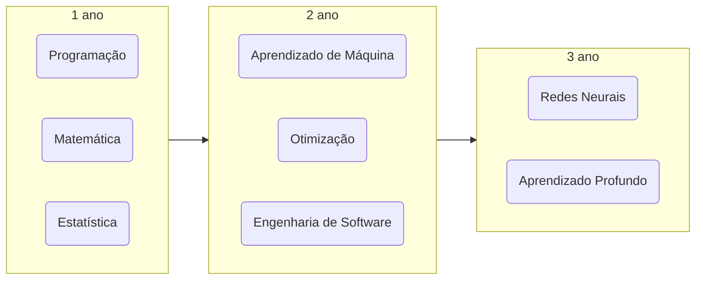

# PUC
Atividades acadêmicas e anotações da minha graduação em Ciência de Dados e Inteligência Artificial na PUC-SP

```mermaid
flowchart LR
    one-->two
    two-->three
    subgraph three["3 ano"]
    direction LR
    c1("Redes Neurais")
    c2("Aprendizado Profundo")
    click c2 "http://www.github.com"
    end
    subgraph two["2 ano"]
    direction LR
    b1("Aprendizado de Máquina")
    b2("Otimização")
    b3("Engenharia de Software")
    end
    subgraph one["1 ano"]
    direction LR
    a1("Programação")
    a2("Matemática")
    a3("Estatística")
    end
```
