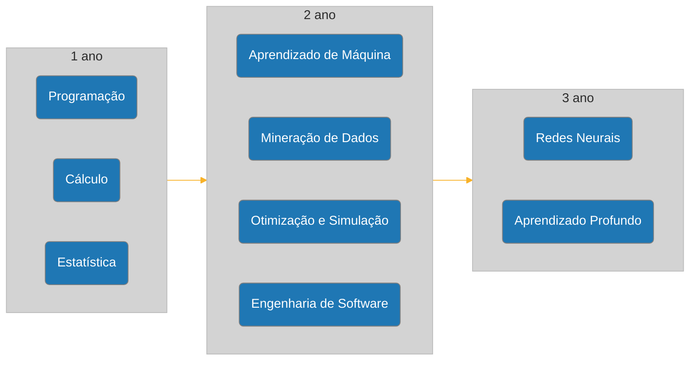

# CDIA PUC
Atividades acadêmicas e anotações da minha graduação em Ciência de Dados e Inteligência Artificial na PUC-SP
## Trilha de estudos

## Grade Curricular

| Sem. | Disciplina | CH |
| :-: | :-- | :-: |
| 1 | Consultoria Especializada de Apoio ao Projeto Integrado - Matemática | 108 |
| 1 | Consultoria Especializada de Apoio ao Projeto Integrado: Algorítmos e Programação | 108 |
| 1 | Estudos Orientados: Ciência de Dados e Inteligência Artificial | 72 |
| 1 | Introdução ao Pensamento Teológico | 54 |
| 1 | Projeto Integrado - Aquisição e Visualização de Dados (Storytelling) | 72 |
| 2 | Consultoria Especializada de Apoio ao Projeto Integrado: Estrutura de Dados e Programação | 108 |
| 2 | Consultoria Especializada de Apoio ao Projeto Integrado: Probabilidade e Estatística | 108 |
| 2 | Estudos Orientados: Estrutura e Base de Dados | 72 |
| 2 | Projeto Integrado: Estatística sobre Bases de Dados | 72 |
| 2 | Teologia em Diálogo com as Tecnociências | 54 |
| 3 | Consultoria Especializada de Apoio ao Projeto Integrado: Bancos de Dados (Sql e Nosql) | 72 |
| 3 | Consultoria Especializada de Apoio ao Projeto Integrado: Engenharia de Software | 72 |
| 3 | Consultoria Especializada de Apoio ao Projeto Integrado: Otimização e Simulação | 72 |
| 3 | Estudos Orientados: Negócios | 72 |
| 3 | Projeto Integrado: Negócios (Logística, Finanças, Crédito, Engenharia, Saúde e Outros) | 108 |
| 4 | Consultoria Especializada de Apoio ao Projeto Integrado: Mineração de Dados | 108 |
| 4 | Empreendedorismo em CD e IA | 36 |
| 4 | Orientação Profissional | 36 |
| 4 | Projeto Integrado: Redes Sociais e Marketing | 108 |
| 5 | Consultoria Especializada de Apoio ao Projeto Integrado: Aprendizagem de Máquina | 72 |
| 5 | Consultoria Especializada de Apoio ao Projeto Integrado: Sistemas Distribuídos | 72 |
| 5 | Governança de Algorítmos | 36 |
| 5 | Projeto Integrado: Segurança Cibernética e Engenharia Social | 108 |
| 6 | Consultoria Especializada em Ciências de Dados 1 | 72 |
| 6 | Consultoria Especializada em Inteligência Artificial 1 | 72 |
| 6 | Optativa da Universidade 1 | 54 |
| 6 | Projeto Integrado: Trabalho de Conclusão de Curso 1 | 108 |
| 7 | Consultoria Especializada em Ciências de Dados 2 | 72 |
| 7 | Consultoria Especializada em Inteligência Artificial 2 | 72 |
| 7 | Optativa da Universidade 2 | 54 |
| 7 | Projeto Integrado: Trabalho de Conclusão de Curso 2 | 108 |
