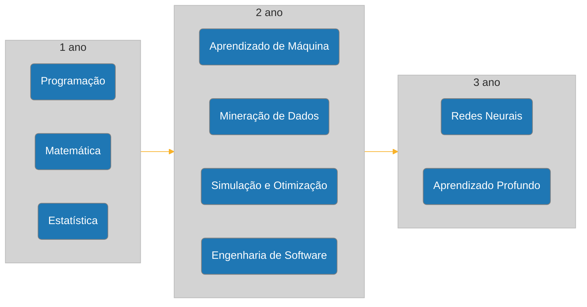

# CDIA PUC
Atividades acadêmicas e anotações da minha graduação em Ciência de Dados e Inteligência Artificial na PUC-SP
## Trilha de estudos

## Grade Curricular

| Sem. | Disciplina | CH |
| :-: | :-- | :-: |
| 1 | Consultoria Especializada de Apoio ao Projeto Integrado: Matemática (Funções e Discreta) | 72 |
| 1 | Consultoria Especializada de Apoio ao Projeto Integrado: Algoritmos e Programação | 36 |
| 1 | Introdução ao Pensamento Teológico | 54 |
| 1 | Estudos Orientados | 72 |
| 1 | Projeto Integrado: Aquisição e Visualização de Dados | 72 |
| 2 | Consultoria Especializada de Apoio ao Projeto Integrado: Probabilidade e Estatística | 72 |
| 2 | Consultoria Especializada de Apoio ao Projeto Integrado: Estrutura de Dados e Programação | 36 |
| 2 | Teologia em Diálogo com as Tecnociências | 54 |
| 2 | Estudos Orientados | 72 |
| 2 | Projeto Integrado: Aquisição e Visualização de Dados | 72 |
| 3 | Consultoria Especializada de Apoio ao Projeto Integrado: Probabilidade e Estatística | 72 |
| 3 | Consultoria Especializada de Apoio ao Projeto Integrado: Otimização e Simulação | 36 |
| 3 | Consultoria Especializada de Apoio ao Projeto Integrado: Bancos de dados (SQL e NoSQL) | 36 |
| 3 | Estudos Orientados | 72 |
| 3 | Projeto Integrado: Negócios (Logística, Finanças, Crédito, Engenharia etc.)) | 108 |
| 4 | Consultoria Especializada de Apoio ao Projeto Integrado: Mineração de Dados | 72 |
| 4 | Orientação profissional | 36 |
| 4 | Governança de Algoritmos | 36 |
| 4 | Projeto Integrado: Redes Sociais e Marketing | 108 |
| 5 | Consultoria Especializada de Apoio ao Projeto Integrado: Aprendizagem de Máquina | 72 |
| 5 | Consultoria Especializada de Apoio ao Projeto Integrado: Sistemas Distribuídos | 36 |
| 5 | Projeto Integrado: Segurança Cibernética e Engenharia Social | 108 |
| 6 | Consultoria Especializada em Ciência de Dados 1: Eletiva | 36 |
| 6 | Consultoria Especializada em Inteligência Artificial 1: Eletiva | 36 |
| 6 | Optativa da Universidade | 54 |
| 6 | Trabalho de Conclusão de Curso 1 | 108 |
| 7 | Consultoria Especializada em Ciência de Dados 2: Eletiva | 36 |
| 7 | Consultoria Especializada em Inteligência Artificial 2: Eletiva | 36 |
| 7 | Optativa da Universidade | 54 |
| 7 | Trabalho de Conclusão de Curso 2 | 108 |
