# CDIA PUC

Atividades acadêmicas e anotações da minha graduação em Ciência de Dados e Inteligência Artificial na PUC-SP
## Trilha de estudos

```mermaid
%%{
  init: {
    'theme': 'base',
    'themeVariables': {
      'primaryColor': '#1f77b4',
      'primaryTextColor': '#fff',
      'primaryBorderColor': '#7F7F7F',
      'lineColor': '#F8B229',
      'secondaryColor': '#7F7F7F',
      'tertiaryColor': '#d3d3d3'
    }
  }
}%%

flowchart LR
    one-->two
    two-->three
    subgraph three["3 ano"]
    direction LR
    c1("<a href='https://github.com/olucaslopes/PUC/tree/main/Redes%20Neurais' style='color: inherit;text-decoration: inherit;'>🧠 Redes Neurais</a>")
    c2("<a href='https://github.com/olucaslopes/PUC/tree/main/Sistemas%20Distribu%C3%ADdos' style='color: inherit;text-decoration: inherit;'>🐘  Sistemas Distribuídos</a>")
    end
    subgraph two["2 ano"]
    direction LR
    b1("<a href='https://github.com/olucaslopes/PUC/tree/main/Aprendizado%20de%20M%C3%A1quina' style='color: inherit;text-decoration: inherit;'>🦾 Aprendizado de Máquina</a>")
    b2("<a href='https://github.com/olucaslopes/PUC/tree/main/Minera%C3%A7%C3%A3o%20de%20Dados' style='color: inherit;text-decoration: inherit;'>⛏️ Mineração de Dados</a>")
    b3("<a href='https://github.com/olucaslopes/PUC/tree/main/Otimiza%C3%A7%C3%A3o%20e%20Simula%C3%A7%C3%A3o' style='color: inherit;text-decoration: inherit;'>🚀 Otimização e Simulação</a>")
    b4("<a href='https://github.com/olucaslopes/PUC/tree/main/Engenharia%20de%20Software' style='color: inherit;text-decoration: inherit;'>⚙️ Engenharia de Software</a>")
    end
    subgraph one["1 ano"]
    direction LR
    a1("<a href='https://github.com/olucaslopes/PUC/tree/main/Programa%C3%A7%C3%A3o' style='color: inherit;text-decoration: inherit;'>👨🏻‍💻 Programação</a>")
    a2("<a href='https://github.com/olucaslopes/PUC/tree/main/C%C3%A1lculo%20I' style='color: inherit;text-decoration: inherit;'>📐 Cálculo</a>")
    a3("<a href='https://github.com/olucaslopes/PUC/tree/main/Estat%C3%ADstica' style='color: inherit;text-decoration: inherit;'>📊 Estatística</a>")
    end
```

## Projeto Pedagógico Do Curso

O arquivo [PPC-CDIA-v2020-02-07.pdf](./PPC-CDIA-v2020-02-07.pdf) contém o Projeto Pedagógico do Curso. Nele é possível encontrar informações como objetivos do curso, perfil do egresso, estrutura curricular, metodologia, matriz curricular, quadro de atividades complementares, entre outras informações.

## Grade Curricular

| Sem. | Disciplina |
| :-: | :-- |
| 1 | [Cálculo I](./C%C3%A1lculo%20I/) |
| 1 | [Algorítmos e Programação](./Programa%C3%A7%C3%A3o/) |
| 1 | Introdução ao Pensamento Teológico |
| 1 | Projeto Integrado: Aquisição e Visualização de Dados (Storytelling) |
| 2 | [Estrutura de Dados e Programação](./Programa%C3%A7%C3%A3o/) |
| 2 | [Probabilidade e Estatística](./Estat%C3%ADstica/) |
| 2 | Projeto Integrado: Estatística sobre Bases de Dados |
| 2 | Teologia em Diálogo com as Tecnociências |
| 3 | Bancos de Dados (Sql e Nosql) |
| 3 | [Engenharia de Software](./Engenharia%20de%20Software) |
| 3 | [Otimização e Simulação](./Otimiza%C3%A7%C3%A3o%20e%20Simula%C3%A7%C3%A3o/) |
| 3 | [Projeto Integrado: Aprendizado de Máquina I ](./Aprendizado%20de%20M%C3%A1quina/) |
| 4 | [Mineração de Dados](./Minera%C3%A7%C3%A3o%20de%20Dados/) |
| 4 | Empreendedorismo em CD e IA |
| 4 | Orientação Profissional |
| 4 | [Projeto Integrado: Aprendizado de Máquina II](./Aprendizado%20de%20M%C3%A1quina/) |
| 5 | [Redes Neurais](./Redes%20Neurais/) |
| 5 | [Sistemas Distribuídos](./Sistemas%20Distribu%C3%ADdos/) |
| 5 | Governança de Algorítmos |
| 5 | Projeto Integrado: Segurança Cibernética e Engenharia Social |
| 6 | Consultoria Especializada em Ciências de Dados 1 |
| 6 | Consultoria Especializada em Inteligência Artificial 1 |
| 6 | Optativa da Universidade 1 |
| 6 | Projeto Integrado: Trabalho de Conclusão de Curso 1 |
| 7 | Consultoria Especializada em Ciências de Dados 2 |
| 7 | Consultoria Especializada em Inteligência Artificial 2 |
| 7 | Optativa da Universidade 2 |
| 7 | Projeto Integrado: Trabalho de Conclusão de Curso 2 |
