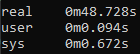
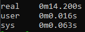
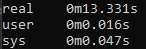

# Semana 3


## Comparando Programação Paralela e Sequencial

> **Warning**\
> Os programas executados nessa aula foram executados no **Linux**. Não há garantia que eles funcionem em outros sistemas operacionais

### Calculando média de vendas sequencialmente

`calcularmediav.py` => implementação processamento sequencial

Como executar:
```bash
$ python3 ./calcularmediav.py ./data/janeiro.txt ./data/fevereiro.txt ./data/marco.txt ./data/abril.txt
```

Tempo de processamento:



> **Note**\
> Para medir o tempo de processamento, use o comando `time` no shell antes de executar os comandos

### Calculando média de vendas em paralelo usando processos

`calcularmediav_processo.py` => implementação processamento paralelo

Como executar:
```bash
$ python3 ./calcularmediav_processo.py ./data/janeiro.txt ./data/fevereiro.txt ./data/marco.txt ./data/abril.txt
```

Tempo de processamento:



## Threads

Thread é um fluxo de execução. Um thread é um *light weighted process*

### Threads vs Process

 *"A process is defined as a task that is being completed by the computer, whereas a thread is a lightweight process that can be managed independently by a scheduler."*

 Um processo é composto por uma os mais threads

 Dúvida: o que são as threads do processador? você explicou a aula como se um núcleo do processador pudesse receber somente uma thread

### Thread de usuário vs Thread de kernel

A diferença principal entre as duas é o nível de suporte do sistema operacional. Threads de usuário são gerenciados pela aplicação em si, sem a necessidade de intervenção do sistema operacional. Por outro lado, threads de kernel são gerenciados pelo sistema operacional diretamente.

### Calculando média de vendas em paralelo usando threads

`calcularmediav_thread.py` => implementação processamento paralelo

Como executar:
```bash
$ python3 ./calcularmediav_thread.py ./data/janeiro.txt ./data/fevereiro.txt ./data/marco.txt ./data/abril.txt
```

Tempo de processamento:




## Comando

`ps -a` => mostra todos os processos

`ps -T -p <pid_processo>` => mostra todas as threads de um processo